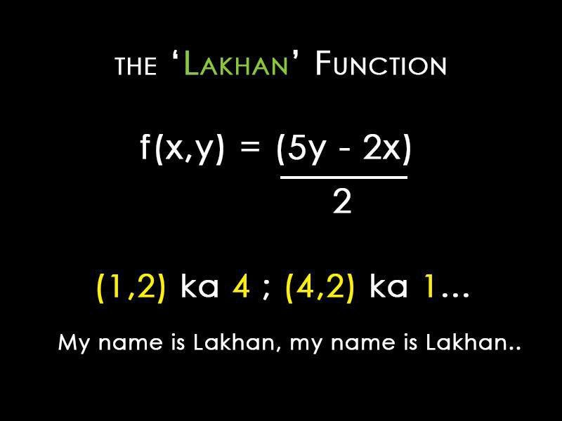

# THE LAKHAN FUNCTION 

The trending meme in India shows a linear equation which when give the parameters (1, 2) and (4, 2) outputs 4 and 1 respectively, which is according the a famous bollywood song in India.

Here, I tried to derive the coefficients of the equation using python and two of the famous libraries, numpy and scikit-learn.

The result comes to be (-1, 2.5) which is similar to the equation shown in the image.
